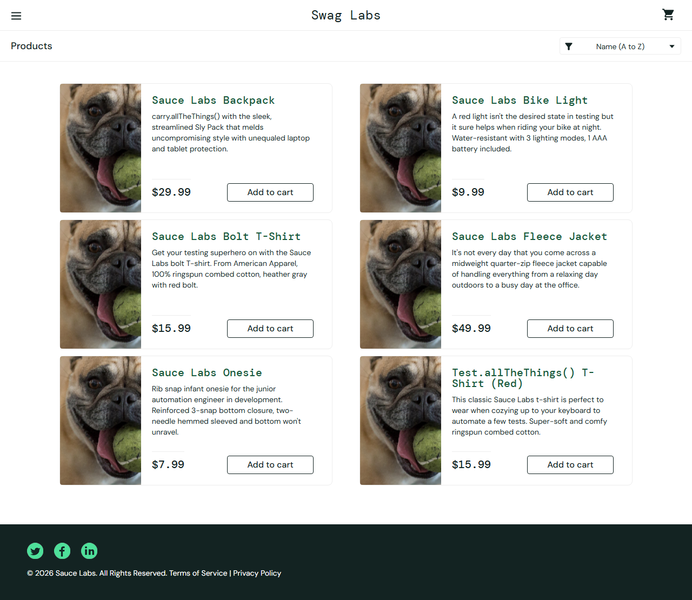

# Bug Report — BUG-001

## Souhrn
U uživatele `problem_user` zobrazuje SauceDemo inventory stránka identický (rozbitý) obrázek u všech 6 produktů místo unikátních produktových fotek.

## Prostředí
- **OS:** Windows 11
- **Prohlížeč:** Chromium (Playwright)
- **Python:** 3.12
- **Testovaná aplikace:** SauceDemo (https://www.saucedemo.com)
- **Branch:** `main`

## Kroky k reprodukci
1. Otevři `https://www.saucedemo.com`
2. Zadej username `problem_user` a password `secret_sauce`
3. Klikni na "Login"
4. Na inventory stránce zkontroluj `src` atribut obrázku u každého ze 6 produktů

## Očekávané chování
Každý produkt má vlastní unikátní obrázek odpovídající danému produktu — stejně jako u `standard_user`:

| Produkt | Obrázek (standard_user) |
|---|---|
| Sauce Labs Backpack | `sauce-backpack-1200x1500....jpg` |
| Sauce Labs Bike Light | `bike-light-1200x1500....jpg` |
| Sauce Labs Bolt T-Shirt | `bolt-shirt-1200x1500....jpg` |
| Sauce Labs Fleece Jacket | `sauce-pullover-1200x1500....jpg` |
| Sauce Labs Onesie | `red-onesie-1200x1500....jpg` |
| Test.allTheThings() T-Shirt (Red) | `red-tatt-1200x1500....jpg` |

→ 6 unikátních `src` hodnot.

## Skutečné chování
Všech 6 produktů odkazuje na stejný soubor `sl-404.168b1cce10384b857a6f.jpg` (404/placeholder obrázek):

```
Sauce Labs Backpack -> sl-404.168b1cce10384b857a6f.jpg
Sauce Labs Bike Light -> sl-404.168b1cce10384b857a6f.jpg
Sauce Labs Bolt T-Shirt -> sl-404.168b1cce10384b857a6f.jpg
Sauce Labs Fleece Jacket -> sl-404.168b1cce10384b857a6f.jpg
Sauce Labs Onesie -> sl-404.168b1cce10384b857a6f.jpg
Test.allTheThings() T-Shirt (Red) -> sl-404.168b1cce10384b857a6f.jpg
```

→ 1 unikátní `src` hodnota (místo očekávaných 6).

## Důkazy


Automatizovaný test: [`tests/ui/test_inventory.py::TestInventoryNegative::test_problem_user_sees_unique_product_images`](../../tests/ui/test_inventory.py)
Allure evidence: screenshot + seznam `src` atributů přiložen jako attachment při selhání testu.

## Severity
- [ ] Critical
- [x] **Major** — vizuální regrese, produkty nelze vizuálně odlišit; blokuje nákupní rozhodnutí uživatele
- [ ] Minor
- [ ] Trivial

## Poznámky
`problem_user` je záměrně "buggy" perzona v SauceDemo (demo aplikace pro QA trénink), takže toto chování je očekávané a stabilní napříč běhy — vhodné jako deterministický regresní test. Pokrytí přidáno jako negative test (`@pytest.mark.negative`), aby šlo snadno ověřit, že chyba zůstává konzistentní mezi verzemi aplikace.
